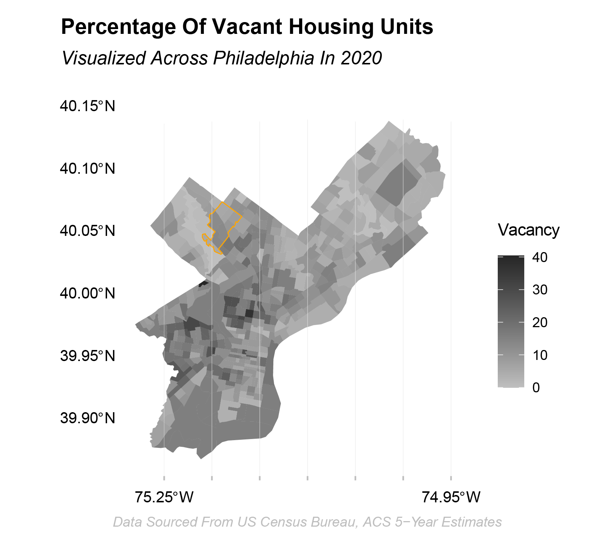
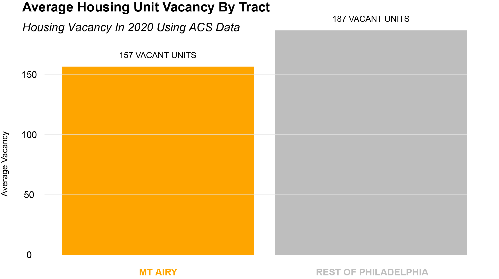
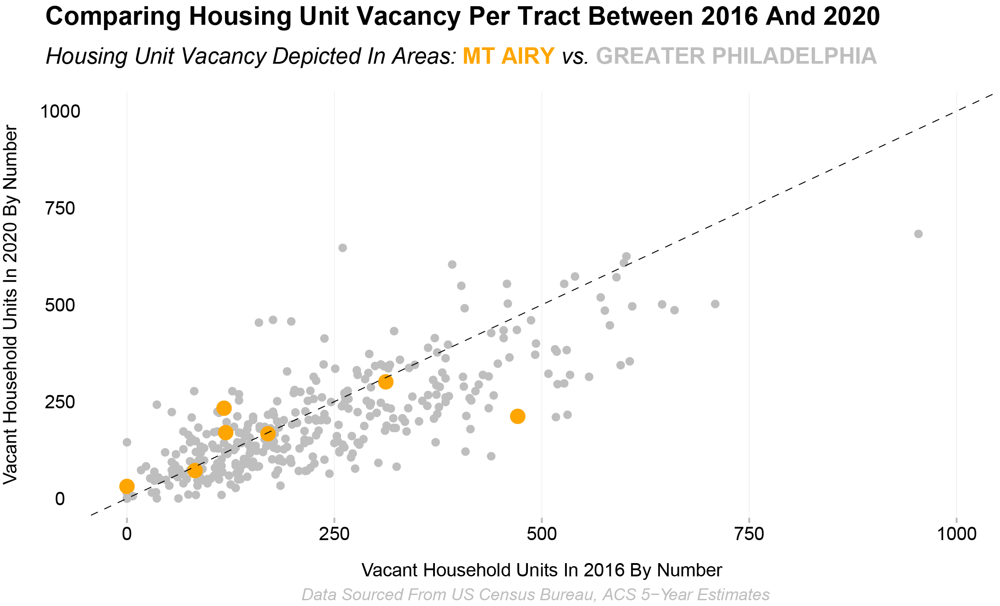

Data Visualization - Communication In Urban Spatial Analytics | 10.17.2023 | Alec Jacobs

```{r knitting_options, include = FALSE, echo = FALSE}

# Global Options For Knitting Chunks

knitr::opts_chunk$set(echo = TRUE)

```

```{r import_libraries, include = FALSE, echo = FALSE}

# Loading In Project Specific Library Packages

library(tidyverse) # Data Science Workflow & Representation
library(tidycensus) # Load United States Census Boundary & Attribute Data
library(sf) # Standardized Way To Encode Spatial Vector Data
library(kableExtra)
library(socviz)
library(lubridate)
library(scales)
library(grid)
library(gridExtra)
library(gridtext)
library(ggtext)
library(dplyr)
library(cols4all)

```

```{r personal_theme, include = FALSE, echo = FALSE}

theme_musa <- function(){
  font = "sans"
  theme_minimal() %+replace%
    
    theme(
      panel.grid.major = element_blank(),
      panel.grid.minor = element_blank(),
      
      axis.ticks = element_blank(),
      axis.ticks.x.bottom = element_line(color = "grey", size = .5),

      plot.margin = margin(1,1,1,1),
      
      plot.title = element_text(
        family = font,
        size = 14,
        face = 'bold',
        hjust = 0,
        vjust = 0,
        margin = margin(2, b = 10)),
      
      plot.subtitle = element_text(
        family = font,
        size = 12,
        hjust = 0,
        margin = margin(2, b = 10),
        face = "italic"),
      
      plot.caption = element_text(
        family = font,
        size = 10,
        hjust = 1),
      
      axis.title = element_text(
        family = font,
        size = 10,
        margin = margin(5, b = 10)),
      
      axis.text = element_text(
        family = font,
        size = 10),
      axis.text.y = element_text(
        margin = margin(5, b = 10)),
      )
}

```

```{r additional_setup, include = FALSE, echo = FALSE}

# Setting A Specific Color Palette & CRS For Visualizations

my_palette <- scale_fill_gradient(low = "grey75", high = "grey15")
```

```{r load_key, warning = FALSE, include = FALSE}

# Loading In Personal API Key - United States Census

census_api_key("414406b135438f0931a42af29200ddeb3f371958", overwrite = TRUE)

```

```{r load_variables, cache = TRUE, echo = FALSE, include = FALSE}

# Loading In United States Census Data Dictionaries / Variables

acs_variable_list.2020 <- load_variables(2020, #year
                                         "acs5", #five year ACS estimates
                                         cache = TRUE)

acs_variable_list.2016 <- load_variables(2016, #year
                                         "acs5", #five year ACS estimates
                                         cache = TRUE)
```

```{r acs_vars, echo = FALSE, include = FALSE}

# Creating Census Variable Vectors

acs_vars <- c("B01001_001E", # ACS total Pop estimate
              "B25002_001E", # Estimate of total housing units
              "B25002_003E", # Number of vacant housing units
              "B19013_001E", # Median HH Income ($)
              "B02001_002E", # People describing themselves as "white alone"
              "B06009_006E") # Total graduate or professional degree
```

```{r get_acs_2020, cache = TRUE, message = FALSE, warning = FALSE, results= 'hide', include = FALSE}

# Calling The Census API To Get Tract Level Data For 2020 For All Of Philadelphia

acsTractsPHL.2020 <- get_acs(geography = "tract",
                             year = 2020, 
                             variables = acs_vars, 
                             geometry = FALSE, 
                             state = "PA", 
                             county = "Philadelphia", 
                             output = "wide") 
```

```{r do_some_dplyr, cache = TRUE, results= 'hide', include = FALSE}

# Wrangling Data: Mutating, Selecting And Renaming Variables

acsTractsPHL.2020 <- acsTractsPHL.2020 %>%
  dplyr::select (GEOID, NAME, all_of(acs_vars))

acsTractsPHL.2020 <- acsTractsPHL.2020 %>%
  rename (total_pop.2020 = B01001_001E,
          total_HU.2020 = B25002_001E,
          total_vacant.2020 = B25002_003E,
          med_HH_Income.2020 = B19013_001E,
          total_White.2020 = B02001_002E,
          total_GradDeg.2020 = B06009_006E)

acsTractsPHL.2020 <- acsTractsPHL.2020 %>%
  mutate(vacancyPct.2020 = total_vacant.2020/total_HU.2020,
         pctWhite.2020   = total_White.2020/total_pop.2020)
```

```{r get_acs_2016, cache = TRUE, message = FALSE, results= 'hide', include = FALSE}
acsTractsPHL.2016 <- get_acs(geography = "tract",
                             year = 2016, 
                             variables = acs_vars,
                             geometry = FALSE,
                             state = "PA", 
                             county = "Philadelphia",
                             output = "wide") %>%
  dplyr::select (GEOID, NAME, all_of(acs_vars)) %>% 
  rename (total_pop.2016 = B01001_001E,
          total_HU.2016 = B25002_001E,
          total_vacant.2016 = B25002_003E,
          med_HH_Income.2016 = B19013_001E,
          total_White.2016 = B02001_002E,
          total_GradDeg.2016 = B06009_006E) %>%
  mutate(vacancyPct.2016 = total_vacant.2016/total_HU.2016,
         pctWhite.2016 = total_White.2016/total_pop.2016)
```

```{r left_join_tracts, cache = TRUE, results= 'hide', include = FALSE}

# Joining Data With Left Join

allACS <- left_join(acsTractsPHL.2016, acsTractsPHL.2020,
                    by= c("GEOID"))
```

```{r do_mutates, cache = TRUE, results= 'hide', include = FALSE}

# Performing Column Math Through Mutate

allACS <- allACS %>%
  mutate(change_med_HH_Income = med_HH_Income.2020 - (med_HH_Income.2016 * 1.08), 
         change_Grad_Degree_Pct = (total_GradDeg.2020/total_pop.2020)-(total_GradDeg.2016/total_pop.2016))

```

```{r base_r_summaries_NA_example, cache = TRUE, results= 'hide', include = FALSE}

# Exploring Central Tendancies Of Census Data

mean(allACS$change_med_HH_Income)
```

```{r base_r_summaries_NA_rm, cache = TRUE, results= 'hide', include = FALSE}
mean(allACS$change_med_HH_Income, na.rm = TRUE)

median(allACS$change_med_HH_Income, na.rm = TRUE)
```

```{r summaryTable, cache = TRUE, results= 'hide', include = FALSE}

# Making A Summary Table Depicting Mean And Median Change In Household Income

summaryTable <- allACS %>%
  summarize(mean_change_HH_Income = mean(change_med_HH_Income, na.rm = TRUE),
            med_change_HH_Income = median(change_med_HH_Income, na.rm = TRUE))
```

```{r myTracts, cache = TRUE, results= 'hide', include = FALSE}

# Comparing Geographies Between MT Airy And Greater Philadelphia

myTracts <- c("42101023500", 
              "42101023600", 
              "42101023700", 
              "42101025300", 
              "42101025400",
              "42101025500", 
              "42101025600", 
              "42101038800")

allACS <- allACS %>%
  mutate(mtAiry = ifelse(GEOID %in% myTracts, "MT AIRY", "REST OF PHILADELPHIA"))
```

```{r summary_table_2, cache = TRUE, message = FALSE, warning = FALSE, results= 'hide', include = FALSE}
summaryTable2 <- allACS %>%
  group_by(mtAiry) %>%
  summarize(mean_change_HH_Income = mean(change_med_HH_Income, na.rm = TRUE),
            med_change_HH_Income = median(change_med_HH_Income, na.rm = TRUE))
```

```{r ggplot_point1, warning = FALSE, cache = TRUE, results= 'hide', include = FALSE}

# Graphically Comparing Household Income Between MT Airy and Philadelphia

ggplot(allACS)+
  geom_point(aes(x =med_HH_Income.2016 * 1.08, 
                 y = med_HH_Income.2020,
                 color = mtAiry))+
  geom_abline(intercept = 0, slope = 1)+
  labs(
    title = "2020 Median HH Income as a Function of 2016 Median HH Income",
    subtitle = "All figures in 2020 dollars",
    caption = "Data: US Census Bureau, ACS 5-year estimates",
    x="Med HH Income 2016 ($)", 
    y="Med HH Income 2020 ($)")

```

```{r spatial_tidycensus, message=FALSE, warning=FALSE, include=FALSE, results= 'hide'}

# Spatial Data Analysis and Tidycensus

acsTractsPHL.2020.sf <- get_acs(geography = "tract",
                             year = 2020, 
                             variables = acs_vars, 
                             geometry = TRUE, 
                             state = "PA", 
                             county = "Philadelphia", 
                             output = "wide") %>% 
  dplyr::select (GEOID, NAME, all_of(acs_vars)) %>%
  rename (total_pop.2020 = B01001_001E,
          total_HU.2020 = B25002_001E,
          total_vacant.2020 = B25002_003E,
          med_HH_Income.2020 = B19013_001E,
          total_White.2020 = B02001_002E,
          total_GradDeg.2020 = B06009_006E) %>%
  mutate(vacancyPct.2020 = total_vacant.2020/total_HU.2020,
         pctWhite.2020 = total_White.2020/total_pop.2020) %>%
  mutate(mtAiry = ifelse(GEOID %in% myTracts, "MT AIRY", "REST OF PHILADELPHIA")) %>%
  st_as_sf(crs = 4326)
```

```{r spatial_tidycensus_no_eval, message=FALSE, warning=FALSE, eval = FALSE, results= 'hide', include = FALSE}
acsTractsPHL.2020.sf <- get_acs(geography = "tract",
                             year = 2020, 
                             variables = acs_vars, 
                             geometry = TRUE, 
                             state = "PA", 
                             county = "Philadelphia", 
                             output = "wide") %>% 
  dplyr::select (GEOID, NAME, all_of(acs_vars)) %>%
  rename (total_pop.2020 = B01001_001E,
          total_HU.2020 = B25002_001E,
          total_vacant.2020 = B25002_003E,
          med_HH_Income.2020 = B19013_001E,
          total_White.2020 = B02001_002E,
          total_GradDeg.2020 = B06009_006E) %>%
  mutate(vacancyPct.2020 = total_vacant.2020/total_HU.2020,
         pctWhite.2020 = total_White.2020/total_pop.2020) %>%
  mutate(mtAiry = ifelse(GEOID %in% myTracts, "MT AIRY", "REST OF PHILADELPHIA")) %>%
  st_as_sf(crs = 4326)
```

### Plot One - Spatial Analytics Illustrating Housing Unit Vacancy Across Philadelphia In 2020

```{r spatial_tidycensus_vacancy, message=FALSE, warning=FALSE, cache=TRUE, include = FALSE}
acsTractsPHL.2020.sf <- get_acs(geography = "tract",
                             year = 2020, 
                             variables = acs_vars, 
                             geometry = TRUE, 
                             state = "PA", 
                             county = "Philadelphia", 
                             output = "wide") %>% 
  dplyr::select (GEOID, NAME, all_of(acs_vars)) %>%
  rename (total_pop.2020 = B01001_001E,
          total_HU.2020 = B25002_001E,
          total_vacant.2020 = B25002_003E,
          med_HH_Income.2020 = B19013_001E,
          total_White.2020 = B02001_002E,
          total_GradDeg.2020 = B06009_006E) %>%
  mutate(vacancyPct.2020 = total_vacant.2020/total_HU.2020*100) %>%
  mutate(mtAiry = ifelse(GEOID %in% myTracts, "MT AIRY", "REST OF PHILADELPHIA")) %>%
  st_as_sf(crs = 4326)

```

```{r ggplot_geom_sf, warning = FALSE, include = FALSE}
ggplot()+
  geom_sf(data = acsTractsPHL.2020.sf, aes(fill = vacancyPct.2020),
          color = "transparent")+
  geom_sf(data = acsTractsPHL.2020.sf %>%
            filter(mtAiry == "MT AIRY") %>%
            st_union(),
          color = "white",
          fill = "transparent")+
  labs(
    title = "Percentage Of Vacant Housing Units By Tract In 2020",
    subtitle = "",
    caption = "Data: US Census Bureau, ACS 5-year estimates") +
  theme_musa()+
  theme(plot.title = element_markdown(size = 14),
        panel.grid.major.x = element_line(color="grey90", size = .1)) +
  theme(legend.position = "none") +
  my_palette
```

<br>



<br>

*Figure Description: This map illustrates the 2020 vacancy rate in Mt Airy varying between 0 and 23 percent with the lowest vacancy rates located in the Northern and far Southwestern areas of the neighborhood. The highest vacancy rates are in the South central areas of Mt. Airy.*

For this mapping visualization, I began with consideration of visual order and hierarchy of text. The main header clearly and concisely announces the map's topic (housing vacancy) with a bold typeface. It is complemented with a subtitle delivering location and date information - Philadelphia and 2020. Both the title and subtitle are left justified to reflect our left-to-right reading. The color palette was consciously chosen for its perceptual quality in grayscale. This ensures the map is visually/aesthetically pleasing for easy interpretation. To enhance the connection between different elements on the map, an orange outline was strategically placed around Mt. Airy - drawing attention and facilitating viewer comprehension to the study neighborhood. Background and grid accents (tick marks, borders, fill) were carefully selected/removed to reduce unnecessary clutter that would decrease readability. Mainly, I wanted a toned-down quality visualizing only essential information, thus easily allowing viewers to engage and reflect on the content.

### Plot Two - Bar Graph Displaying Housing Vacancy In Mount Airy In 2020 Compared To The Rest Of Philadelphia  

```{r include = FALSE}
acsTractsPHL.2020 <- acsTractsPHL.2020 %>%
  mutate(mtAiry = ifelse(GEOID %in% myTracts, "MT AIRY", "REST OF PHILADELPHIA"))
```

```{r summaryTable_MtAiry, cache = TRUE, results= 'hide', include = FALSE}

acsTractsPHL.2020 <- acsTractsPHL.2020 %>%
  mutate(mtAiry = ifelse(GEOID %in% myTracts, "MT AIRY", "REST OF PHILADELPHIA"))

summaryTable <- acsTractsPHL.2020 %>%
  group_by(mtAiry) %>%
  summarize(mean_total_vacant.2020 = mean(total_vacant.2020, na.rm = TRUE))
            
  summaryTable %>% kbl(caption = "Average Housing Unit Vacancy By Tract") %>%
  kable_classic(full_width = F, html_font = "Consolas")
```

```{r include = FALSE}
ggplot(data = summaryTable, aes(x = mtAiry, y = mean_total_vacant.2020)) +
  geom_bar(stat = "identity", fill = "grey") +
  labs(title = "Average Housing Unit Vacancy By Tract",
       x = "Tract",
       y = "Average Vacancy") +
  theme_musa()
```

<br>



<br>

*Figure Description: This bar graph titled "Average Housing Unit Vacancy By Tract" shows the average number of vacant housing units per census tract in Mt. Airy and the rest of Philadelphia; showing housing vacancy is lower in Mt. Airy when compared to greater Philadelphia.* 

In this bar graph visualization, I again paid careful attention to the visual order, hierarchy of text, and decluttering of grid elements. The graph features a bold header with a clear and informative subtitle - aligning the text to the left for easy readability. The data source (ACS) is also thoughtfully included in the subtitle to establish credibility in the visualization. To maintain a strong connection between the text and the bars on the graph, color is strategically employed. Notably, "Mt. Airy" is highlighted in orange while the "Rest of Philadelphia" is represented in gray. The number of vacant units (157 vs 187) were also provided above each bar to make it easy for the viewer to interpret/compare the quantity of vacancies in Mt. Airy vs. the rest of Philly. Again, background and grid accents were carefully selected to maintain simplicity while the axis labels were curated to improve context and clarity. Overall, I wanted this graph to be streamlined with reduced noise to create an effective, simple visual.

### Plot Three - Scatter Plot Depicting Housing Vacancy Between 2016 And 2020 In Philadelphia

```{r ggplot_points_vacancy, warning = FALSE, include = FALSE}

custom_colors <- c("orange", "grey")

ggplot(allACS)+
  geom_point(aes(x =total_vacant.2016, 
                 y = total_vacant.2020,
                 color = mtAiry))+
  scale_color_manual(values = custom_colors) +  # Specify Custom Colors
  geom_abline(intercept = 0, slope = 1)+
  xlim(0,1000)+ #Add x Limits to Make Graph Easier to Read
  ylim(0,1000)+ #Add y Limits to Make Graph Easier to Read
  geom_abline(intercept = 0, slope = 1)+
  labs(
    title = "Comparing Housing Unit Vacancy Per Tract Between 2016 And 2020",
    subtitle = "",
    caption = "Data: US Census Bureau, ACS 5-Year Estimates",
    x="Vacant Household Units In 2016 By Number", 
    y="Vacant Household Units In 2020 By Number",
    color="Area")
```

<br>



<br>

*Figure Description: This scatterplot depicts the increase and decrease of housing vacancy per census unit across Philadelphia. Notably, in all census tracts except one in Mt. Airy, the number of vacant housing units roughly stayed the same or increased.*

This scatterplot was designed similarly to the bar graph and map with strategic use of color, visual order, and hierarchy of text. As seen in the two previous visualizations, this plot features a bold header with an accompanying subtitle. The use of color in the subtitle (orange and gray) creates visual connection between the points on the plot. Further, the size of the points are not only for clarity but also to effectively highlight the difference in vacancy between "Mt Airy" and "Greater Philadelphia." The remaining text elements along the axes were visualized in a size and weight as to not overpower or detract from the point visualization. 
The subtle grid accents and tick marks were improved to eliminate distraction, ensuring they don't get lost in the busyness of the point visualization. The overall design strategy of this plot was to effectively convey the story without overwhelming the viewer with extraneous elements.

In summary, the three visualizations followed the Gestalt principles and various pre-attentive techniques (color, form, positioning) to depict housing vacancy across Philadelphia and in particular, the neighborhood of Mt. Airy. I paid close attention to reducing "chartjunk" - cleaning up unnecessary background elements, grid accents, and labels. I was intentional about the title and subtitle, including useful language and left justifying for readability. Attention was paid to color consistency, which I employed consistently throughout (orange and gray) to create connection between the map, the graph, and the scatterplot. All three were designed with a minimalist, journalistic quality, hoping to contribute to an ease of story comprehension.
